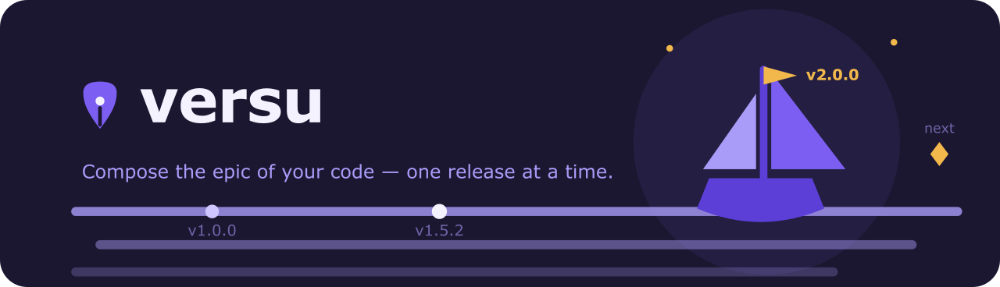

<!-- markdownlint-disable MD041 -->



<!-- markdownlint-enable MD041 -->

# @versu/plugin-maven - Maven Adapter Plugin

Maven adapter plugin for Versu. Provides support for detecting and updating versions in Maven multi-module projects.

## Installation

```bash
npm install @versu/core @versu/plugin-maven
```

## Usage

Once installed, the plugin is discovered automatically from `node_modules` (or list it explicitly in the `plugins` array of your `versu.config.js`):

```typescript
import { VersuRunner } from '@versu/core';

const runner = new VersuRunner({
  repoRoot: '/path/to/repository',
  adapter: 'maven', // Optional - auto-detected
  // ...other options as needed
});

const result = await runner.run();
```

## Auto-Detection

The plugin automatically activates when `pom.xml` is present in the repository root.

## Notes

- Module IDs follow Gradle-style notation (e.g., `:` for root, `:core`, `:lib:utils`).
- The plugin updates:
  - `<project><version>` when the module declares its own version.
  - `<project><parent><version>` when the parent module version changes.

## 📄 License

MIT License - see [LICENSE](LICENSE) for details.
